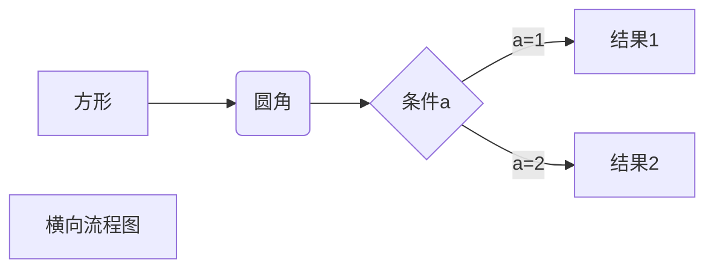
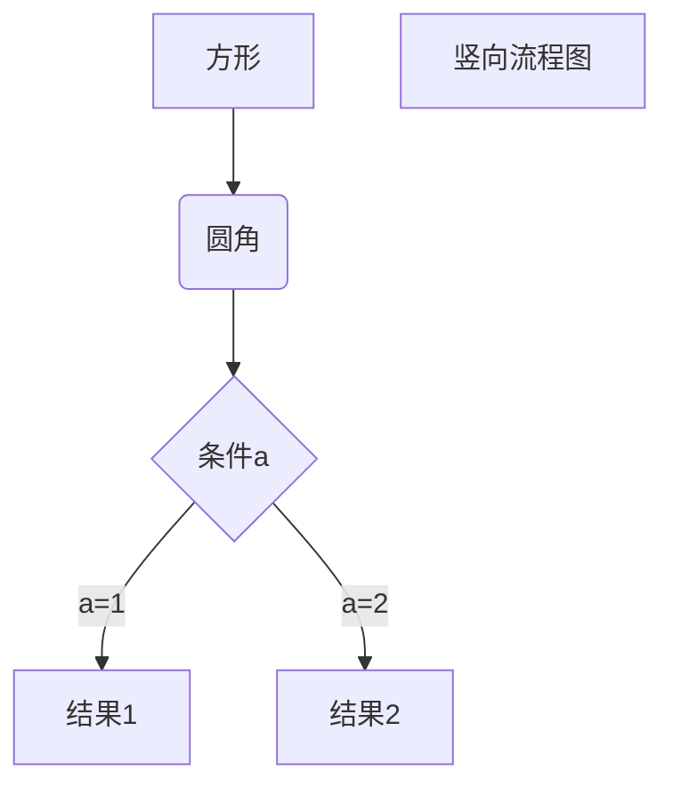
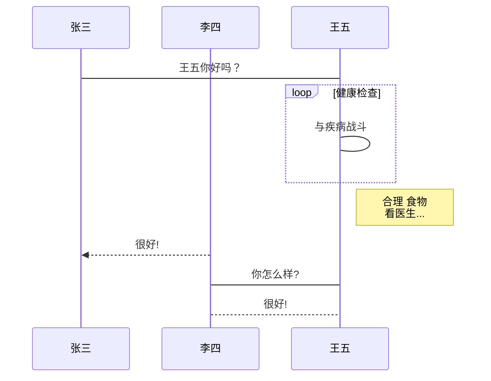
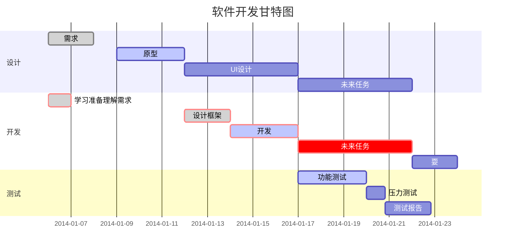

# markdown学习笔记

## 目录 {#1}

[TOC]

## 一、vscode相关插件

### 1 markdownlint

- 功能：用于提示语法

### 2 markdown preview enhanced

- 功能：在VSC中预览Markdown效果，支持导出为PDF

### 3 markdown All in One

- 功能：Markdown增强插件，该插件已经实现了上述#a，#c，#d，#e，#f功能

1. 支持[TOC]自动生成目录（略）
2. 支持Latex语法（略）
3. 支持嵌入代码，代码支持各种语言的语法高亮（略）
4. 支持使用\<font>，\<br>等HTML标签（略）
5. 支持PlantUML语法

## 二、markdown的基础语法

### 1 文本

#### 1.1 标题

```markdown
# 一级标题
## 二级标题
### 三级标题
#### 四级标题
##### 五级标题
###### 六级标题
```

#### 1.2 斜体和粗体

```markdown
*斜体*或_斜体_
**粗体**
***加粗斜体***
```

#### 1.3 删除线和下划线

```markdown
~~删除线~~
<u>下划线</u>
```

~~删除线~~
<u>下划线</u>

### 2 超链接

#### 2.1 行内式

```markdown
欢迎来到[梵居闹市](http://blog.leanote.com/freewalk)
欢迎来到[梵居闹市](http://blog.leanote.com/freewalk "梵居闹市")
```

欢迎来到[梵居闹市](http://blog.leanote.com/freewalk)
欢迎来到[梵居闹市](http://blog.leanote.com/freewalk "梵居闹市")

#### 2.2 参考式

```markdown
我经常去的几个网站[Google][1]、[Leanote][2]以及[自己的博客][3]
[Leanote 笔记][2]是一个不错的[网站][]。

[1]:http://www.google.com "Google"
[2]:http://www.leanote.com "Leanote"
[3]:http://http://blog.leanote.com/freewalk "梵居闹市"
[网站]:http://http://blog.leanote.com/freewalk
```

我经常去的几个网站[Google][1]、[Leanote][2]以及[自己的博客][3]
[Leanote 笔记][2]是一个不错的[网站][]。

[1]:http://www.google.com "Google"
[2]:http://www.leanote.com "Leanote"
[3]:http://http://blog.leanote.com/freewalk "梵居闹市"
[网站]:http://http://blog.leanote.com/freewalk

#### 2.3 自动链接

```markdown
<http://example.com/>
<address@example.com>
```

<http://example.com/>
<address@example.com>

#### 2.4 页内超链接---锚点

##### 2.4.1 html锚点

```markdown
<span id=1>目录</span>
跳转到[目录](#1)
```

##### 2.4.2 普通锚点

```markdown
[目录](#index)
## 目录 {#index}
```

[目录](#1)

#### 2.5 页内跳转---注脚

```markdown
创建脚注格式类似这样 [^1]。
[^1]: 菜鸟教程 -- 学的不仅是技术，更是梦想！！！

创建脚注格式类似这样 [^2]。
[^2]: http://static.runoob.com/images/runoob-logo.png
```

### 3.列表

#### 3.1 无序列表

```markdown
- 无序列表项 一
- 无序列表项 二
- 无序列表项 三
```

- 无序列表项 一
- 无序列表项 二
- 无序列表项 三

#### 3.2 有序列表

```markdown
1. 有序列表项 一
2. 有序列表项 二
3. 有序列表项 三
```

1. 有序列表项 一
2. 有序列表项 二
3. 有序列表项 三

#### 3.3 定义型列表

```markdown
Markdown
:    轻量级文本标记语言，可以转换成html，pdf等格式（左侧有一个可见的冒号和四个不可见的空格）

代码块 2
:   这是代码块的定义（左侧有一个可见的冒号和四个不可见的空格）
        代码块（左侧有八个不可见的空格）
```

Markdown
:    轻量级文本标记语言，可以转换成html，pdf等格式（左侧有一个可见的冒号和四个不可见的空格）

代码块 2
:   这是代码块的定义（左侧有一个可见的冒号和四个不可见的空格）
        代码块（左侧有八个不可见的空格）

#### 3.4 无列表缩进、段落和包含

```markdown
- 轻轻的我走了， 正如我轻轻的来； 我轻轻的招手， 作别西天的云彩。
那河畔的金柳， 是夕阳中的新娘； 波光里的艳影， 在我的心头荡漾。
软泥上的青荇， 油油的在水底招摇；在康河的柔波里， 我甘心做一条水草！

  那榆荫下的一潭， 不是清泉， 是天上虹； 揉碎在浮藻间， 沉淀着彩虹似的梦。
寻梦？撑一支长篙， 向青草更青处漫溯； 满载一船星辉， 在星辉斑斓里放歌。
但我不能放歌， 悄悄是别离的笙箫； 夏虫也为我沉默， 沉默是今晚的康桥！
悄悄的我走了， 正如我悄悄的来； 我挥一挥衣袖， 不带走一片云彩。

- 带快快

  > 1
  > 2
```

- 轻轻的我走了， 正如我轻轻的来； 我轻轻的招手， 作别西天的云彩。那河畔的金柳， 是夕阳中的新娘； 波光里的艳影， 在我的心头荡漾。软泥上的青荇， 油油的在水底招摇；在康河的柔波里， 我甘心做一条水草！

  那榆荫下的一潭， 不是清泉， 是天上虹； 揉碎在浮藻间， 沉淀着彩虹似的梦。
寻梦？撑一支长篙， 向青草更青处漫溯； 满载一船星辉， 在星辉斑斓里放歌。
但我不能放歌， 悄悄是别离的笙箫； 夏虫也为我沉默， 沉默是今晚的康桥！
悄悄的我走了， 正如我悄悄的来； 我挥一挥衣袖， 不带走一片云彩。

- 带快快

  > 1
  > 2

### 4.引用 {#2.4}

```markdown
> 1. 这是第一行列表项。
> 2. 这是第二行列表项。
>
> 给出一些例子代码：
>
>  return shell_exec("echo $input | $markdown_script");
```

> 1. 这是第一行列表项。
> 2. 这是第二行列表项。
>
> 给出一些例子代码：
>
> `return shell_exec("echo $input | $markdown_script");`

### 5.插入图片

#### 5.1 行内式

```markdown
美丽花儿： 

```

美丽花儿： 


#### 5.2 参考式

```markdown
美丽花儿：
![美丽花儿][flower]

[flower]:http://ww2.sinaimg.cn/large/56d258bdjw1eugeubg8ujj21kw16odn6.jpg  "美丽花儿"
```

美丽花儿：
![美丽花儿][flower]

[flower]:http://ww2.sinaimg.cn/large/56d258bdjw1eugeubg8ujj21kw16odn6.jpg  "美丽花儿"

### 6 目录

```markdown
[TOC]
```

### 7 表格

```markdown
学号|姓名|分数
-|:-:|-:
小明|男|75
小红|女|79
小陆|男|92
```

学号|姓名|分数
-|-|-
小明|男|75
小红|女|79
小陆|男|92

### 8 辅助图

#### 8.1 流程图

##### 8.1.1 flow

```markdown
\```flow
st=>start: Start:>https://www.zybuluo.com
io=>inputoutput: verification
op=>operation: Your Operation
cond=>condition: Yes or No?
sub=>subroutine: Your Subroutine
e=>end
st->io->op->cond
cond(yes)->e
cond(no)->sub->io
\```
```

```flow
st=>start: Start:>https://www.zybuluo.com
io=>inputoutput: verification
op=>operation: Your Operation
cond=>condition: Yes or No?
sub=>subroutine: Your Subroutine
e=>end
st->io->op->cond
cond(yes)->e
cond(no)->sub->io
```

##### 8.1.2 mermaid

```markdown
\```mermaid
graph LR
A[方形] -->B(圆角)
    B --> C{条件a}
    C -->|a=1| D[结果1]
    C -->|a=2| E[结果2]
    F[横向流程图]
\```
```



```markdown
\```mermaid
graph TD
A[方形] --> B(圆角)
    B --> C{条件a}
    C --> |a=1| D[结果1]
    C --> |a=2| E[结果2]
    F[竖向流程图]
\```
```



#### 8.2 UML

##### 8.2.1 sequece

```markdown
\```sequence
Title: 标题：UML使用
对象A->对象B: 对象B你好吗?（请求）
Note right of 对象B: 对象B的描述
Note left of 对象A: 对象A的描述(提示)
对象B-->对象A: 我很好(响应)
对象B->小三: 你好吗
小三-->>对象A: 对象B找我了
对象A->对象B: 你真的好吗？
Note over 小三,对象B: 我们是朋友
participant C
Note right of C: 没人陪我玩
\```
```

```sequence
Title: 标题：UML使用
对象A->对象B: 对象B你好吗?（请求）
Note right of 对象B: 对象B的描述
Note left of 对象A: 对象A的描述(提示)
对象B-->对象A: 我很好(响应)
对象B->小三: 你好吗
小三-->>对象A: 对象B找我了
对象A->对象B: 你真的好吗？
Note over 小三,对象B: 我们是朋友
participant C
Note right of C: 没人陪我玩
```

##### 8.2.2 mermaid

```markdown
\```mermaid
sequenceDiagram
    participant 张三
    participant 李四
    张三->王五: 王五你好吗？
    loop 健康检查
        王五->王五: 与疾病战斗
    end
    Note right of 王五: 合理 食物 <br/>看医生...
    李四-->>张三: 很好!
    王五->李四: 你怎么样?
    李四-->王五: 很好!
\```
```



#### 8.3 甘特图

```markdown
\```mermaid
gantt
        dateFormat  YYYY-MM-DD
        title 软件开发甘特图
        section 设计
        需求                      :done,    des1, 2014-01-06,2014-01-08
        原型                      :active,  des2, 2014-01-09, 3d
        UI设计                     :         des3, after des2, 5d
    未来任务                     :         des4, after des3, 5d
        section 开发
        学习准备理解需求                      :crit, done, 2014-01-06,24h
        设计框架                             :crit, done, after des2, 2d
        开发                                 :crit, active, 3d
        未来任务                              :crit, 5d
        耍                                   :2d
        section 测试
        功能测试                              :active, a1, after des3, 3d
        压力测试                               :after a1  , 20h
        测试报告                               : 48h
\```
```



### 9 LaTeX公式

#### 9.1 行内公式

```markdown
质能守恒方程可以用一个很简洁的方程式 $E=mc^2$ 来表达。
```

质能守恒方程可以用一个很简洁的方程式 $E=mc^2$ 来表达。

#### 9.2 整行公式

```markdown
$$\sum_{i=1}^n a_i=0$$
$$f(x_1,x_x,\ldots,x_n) = x_1^2 + x_2^2 + \cdots + x_n^2 $$
$$\sum^{j-1}_{k=0}{\widehat{\gamma}_{kj} z_k}$$

\```math
\begin{Bmatrix}
   a & b \\
   c & d
\end{Bmatrix}
\```
```

$$\sum_{i=1}^n a_i=0$$
$$f(x_1,x_x,\ldots,x_n) = x_1^2 + x_2^2 + \cdots + x_n^2 $$
$$\sum^{j-1}_{k=0}{\widehat{\gamma}_{kj} z_k}$$

$$
\begin{Bmatrix}
   a & b \\
   c & d
\end{Bmatrix}
$$

### 10 代码

#### 10.1 行内式

```markdown
C语言里的函数 `scanf()` 怎么使用？
```

C语言里的函数 `scanf()` 怎么使用？

#### 10.2 代码块

```markdown
\```c
#include <stdio.h>
int main(void)
{
    printf("Hello world\n");
}
\```
```

```c
#include <stdio.h>
int main(void)
{
    printf("Hello world\n");
}
```

### 11 HTML标签

```html
<div class="footer">
   © 2004 Foo Corporation
</div>

<table>
    <tr>
        <th rowspan="2">值班人员</th>
        <th>星期一</th>
        <th>星期二</th>
        <th>星期三</th>
    </tr>
    <tr>
        <td>李强</td>
        <td>张明</td>
        <td>王平</td>
    </tr>
</table>
```

<div class="footer">
   © 2004 Foo Corporation
</div>

<table>
    <tr>
        <th rowspan="2">值班人员</th>
        <th>星期一</th>
        <th>星期二</th>
        <th>星期三</th>
    </tr>
    <tr>
        <td>李强</td>
        <td>张明</td>
        <td>王平</td>
    </tr>
</table>

## 三、LaTeX公式

